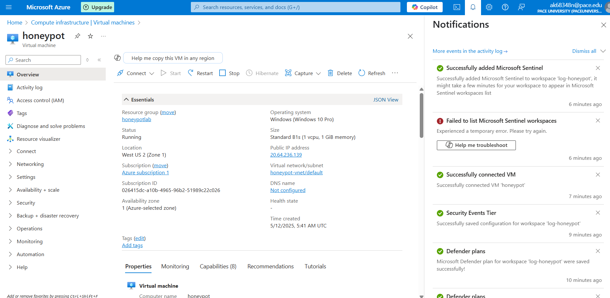
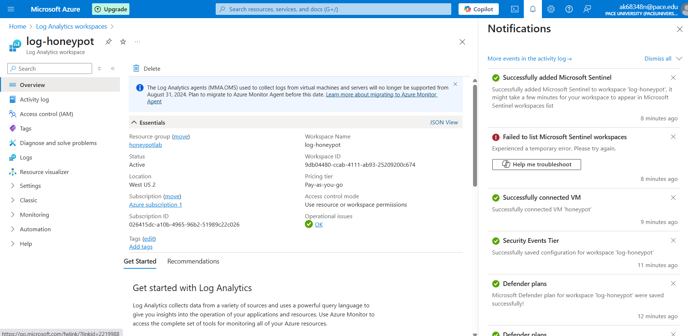

<h1>Azure sentinel - Attack Simulation</h1>

<h2>Description</h2>
This simulation consists of using the Azure sentinel SIEM to visualize simulated attacks on a vm configured as a honeypot. I used custom logs to translate the location data fetched from the geo location api to map them onto 
 

<h2>Languages and Utilities Used</h2>

- <b>PowerShell</b> 
- <b>App.ipgeolocation</b>

<h2>Environments Used </h2>

- <b>Windows 10</b> (21H2)
- <b>Azure Sentinel</b> (21H2)

<h2>Simulation walk-through:</h2>

Setup Virtual Machine in Azure:  

 
 
Setup Analytics Worspace :   

 
 
Setup Azure Defender:  

 
 
Run powershell Script in the VM to ingest logs  

 
 
Create custom log in Azure log analytics workspace to bring in the custom log  

 
 
Extract fields from raw data  

 
 
Setup Map in Sentinel with data  

 
 
Observe the simulated breach attempts on VM  

 
 
