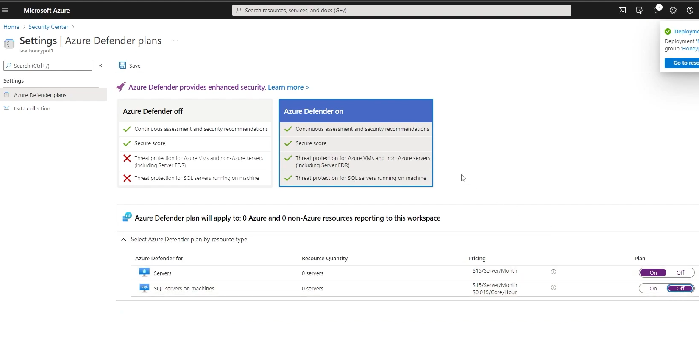
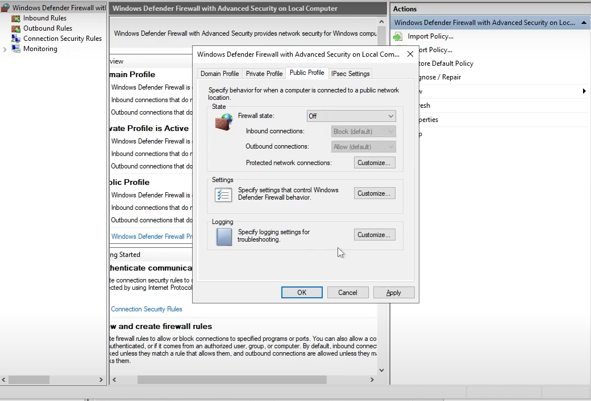
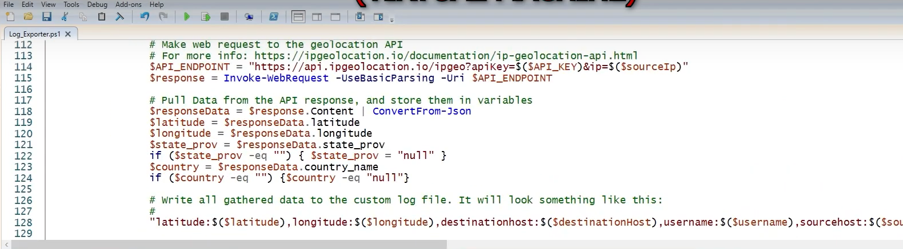
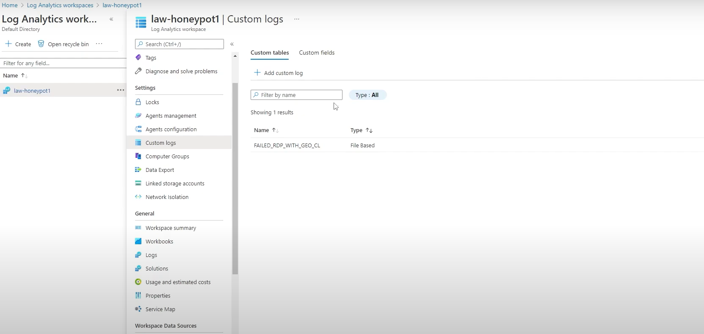
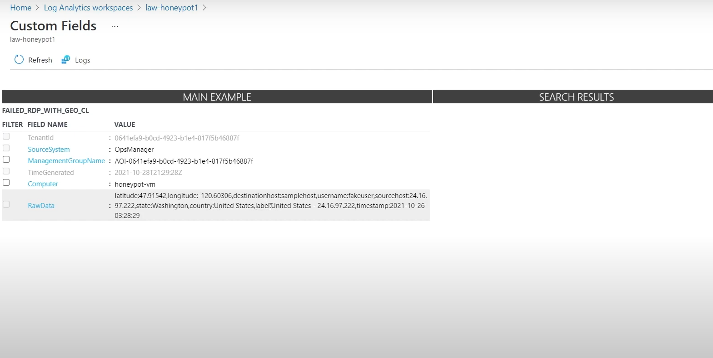
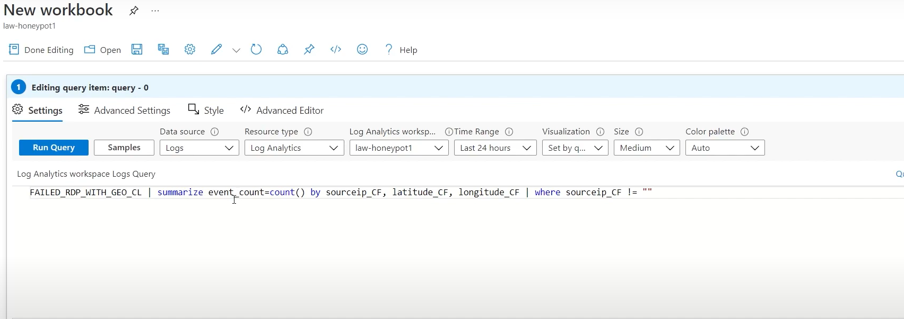
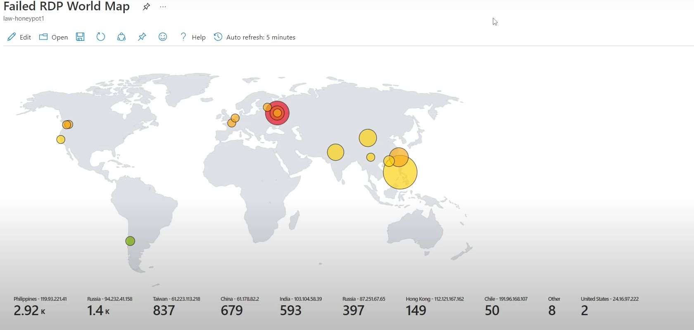

<h1>Azure sentinel - Attack Simulation</h1>

<h2>Description</h2>
This simulation consists of using the Azure sentinel SIEM to visualize simulated attacks on a vm configured as a honeypot. I used custom logs to translate the location data fetched from the geo location api to map them onto 
 

<h2>Languages and Utilities Used</h2>

- <b>PowerShell</b> 
- <b>App.ipgeolocation</b>

<h2>Environments Used </h2>

- <b>Windows 10</b> (21H2)
- <b>Azure Sentinel</b> (21H2)

<h2>Simulation walk-through:</h2>

Setup Virtual Machine in Azure:  

 
 
Setup Analytics Worspace :   

 
 
Setup Azure Defender:  

 
 
Disable Firewall in Virtual Machine 

 
 
Run powershell Script in the VM to Simulate Attack  

 
 
Configure Custom logs in Azure  

 
 
Create Custom Fields in Map  

 
 
Setup Map with Latitude and Longitude  

 
 
Observe the simulated breach attempts on VM  

 
 
